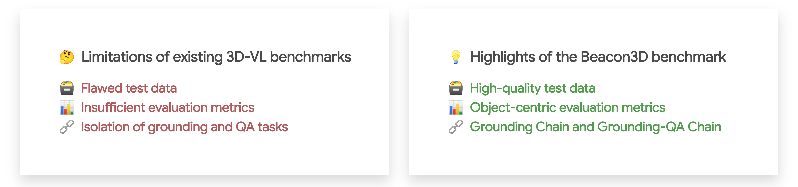

<h2 align="center">
  <span>
    Unveiling the Mist over 3D Vision-Language Understanding:<br/>Object-centric Evaluation with Chain-of-Analysis
  </span>
</h2>

<h3 align="center">
CVPR 2025
</h3>

<div align="center" margin-bottom="6em">
<a target="_blank" href="https://huangjy-pku.github.io/">Jiangyong Huang<sup>✶</sup></a>,&nbsp;
<a target="_blank" href="https://buzz-beater.github.io/">Baoxiong Jia<sup>✶</sup></a>,&nbsp;
<a target="_blank" href="https://github.com/jetpackfirstme">Yan Wang</a>,&nbsp;
<a target="_blank" href="https://zhuziyu-edward.github.io/">Ziyu Zhu</a>,&nbsp;
<a target="_blank" href="https://github.com/Germany321">Xiongkun Linghu</a>,
<br/>
<a target="_blank" href="https://liqing-ustc.github.io/">Qing Li</a>,&nbsp;
<a target="_blank" href="http://www.stat.ucla.edu/~sczhu/">Song-Chun Zhu</a>,&nbsp;
<a target="_blank" href="https://siyuanhuang.com/">Siyuan Huang</a>

</div>
&nbsp;

<div align="center">
    <a href="https://arxiv.org/abs/2503.22420" target="_blank">
    </a>
    <a href="https://beacon-3d.github.io/" target="_blank">
    </a>
    <a href="https://youtu.be/8hiGFwCQMjk" target="_blank">
    </a>
    <a href="https://github.com/beacon-3d/beacon-3d/blob/main/data" target="_blank">
    </a>
    <a href="https://huggingface.co/spaces/huangjy-pku/Beacon3D-Demo" target="_blank">
    </a>
</div>
&nbsp;

We introduce **Beacon3D**, a novel benchmark and evaluation protocol for 3D vision-language (3D-VL) models. **Beacon3D** covers both 3D grounding and question answering (QA) tasks, featuring an *object-centric evaluation framework* and *chain analysis for studying task coherence*.

<div align="center">

</div>

This repository provides the [test data](#data), [evaluation pipeline](#evaluation), and an up-to-date [leaderboard](#leaderboard).

**Note:** The released data has been meticulously refined and may differ from the initial version used in the paper. Please refer to the [leaderboard](#leaderboard) for the latest results. We welcome updates or pull requests for adding the evaluation results of new models to the leaderboard.

**Note:** 3RScan and MultiScan data will be released soon. Stay tuned.

## Leaderboard

### ScanNet: QA

| Model | Class | App. | Geo. | Spa. | Exi. | Overall (Case) | Overall (Obj.) |
| :---: | :---: | :---: | :---: | :---: | :---: | :---: | :---: |
| [PQ3D](https://pq3d.github.io/) | 37.8 | 45.8 | 32.1 | 19.2 | 44.5 | 35.9 | 4.2 |
| [SceneVerse](https://scene-verse.github.io/) | 26.4 | 40.4 | 40.0 | 35.0 | 54.1 | 40.5 | 4.7 |
| [LEO](https://embodied-generalist.github.io/) | 16.4 | 39.8 | 47.6 | 52.8 | 54.3 | 45.2 | 7.5 |

### ScanNet: Grounding

| Model | Class | App. | Geo. | Spa. | Overall (Case) | Overall (Obj.) |
| :---: | :---: | :---: | :---: | :---: | :---: | :---: |
| [PQ3D](https://pq3d.github.io/) | 74.4 | 75.5 | 62.1 | 76.8 | 74.4 | 60.0 |
| [SceneVerse](https://scene-verse.github.io/) | 73.4 | 65.3 | 61.6 | 73.0 | 73.4 | 51.4 |

### 3RScan
Coming soon

### MultiScan
Coming soon

## Get Started

1. Clone Github repo.
```shell
git clone git@github.com:beacon-3d/beacon-3d.git
cd beacon-3d
```
2. Setup environment. This step can be ignored since the code only involves `numpy`, `openai`, and `tqdm`.
3. Check out [data](#data) and [evaluation](#evaluation).

## Data
The test data is in `data/{domain}`, where `{domain}` includes scannet, 3rscan, and multiscan.

**Metadata.** The metadata records grounding chains and grounding-QA chains for each object.

**Format process.** We provide scripts to convert the metadata into ScanRefer format (for grounding) and ScanQA format (for QA). We also provide the json files after this process (without `metadata` prefix) that are ready to use.
```shell
cd data

# take scannet for example

# grounding
python grounding_to_scanrefer_format.py --domain scannet --src scannet/metadata_scannet_grounding.json --dst scannet/scannet_grounding.json

# QA
python qa_to_scanqa_format.py --domain scannet --src scannet/metadata_scannet_qa.json --dst scannet/scannet_qa.json

cd ..
```


## Evaluation
**TODO before running evaluation.** Implement the `extract_pred` function in `evaluate_grounding.py` and `evaluate_qa.py` to process the raw inference results from your model. Remember to setup your OpenAI API key before running `evaluate_qa.py`.

**Run evaluation.** Run `evaluate_grounding.py` and `evaluate_qa.py`. For Grounding-QA chain analysis, you need to add a path of the processed grounding results.
```shell
# take scannet for example

# grounding
python evaluate_grounding.py --infer ${inference_results_path} --output ${processed_results_path} --data data/scannet/scannet_grounding.json --metadata data/scannet/metadata_scannet_grounding.json

# QA
python evaluate_qa.py --infer ${inference_results_path} --output ${processed_results_path} --data data/scannet/scannet_qa.json --metadata data/scannet/metadata_scannet_qa.json

# QA (with GQA-Chain analysis)
python evaluate_qa.py --infer ${inference_results_path} --output ${processed_results_path} --data data/scannet/scannet_qa.json --metadata data/scannet/metadata_scannet_qa.json --grounding ${processed_grounding_results_path}
```


## BibTex
```bibtex
@inproceedings{huang2025unveiling,
  title={Unveiling the Mist over 3D Vision-Language Understanding: Object-centric Evaluation with Chain-of-Analysis},
  author={Huang, Jiangyong and Jia, Baoxiong and Wang, Yan and Zhu, Ziyu and Linghu, Xiongkun and Li, Qing and Zhu, Song-Chun and Huang, Siyuan},
  booktitle={Proceedings of the IEEE/CVF Conference on Computer Vision and Pattern Recognition (CVPR)},
  year={2025}
}
```
